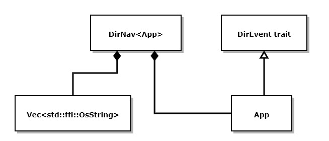
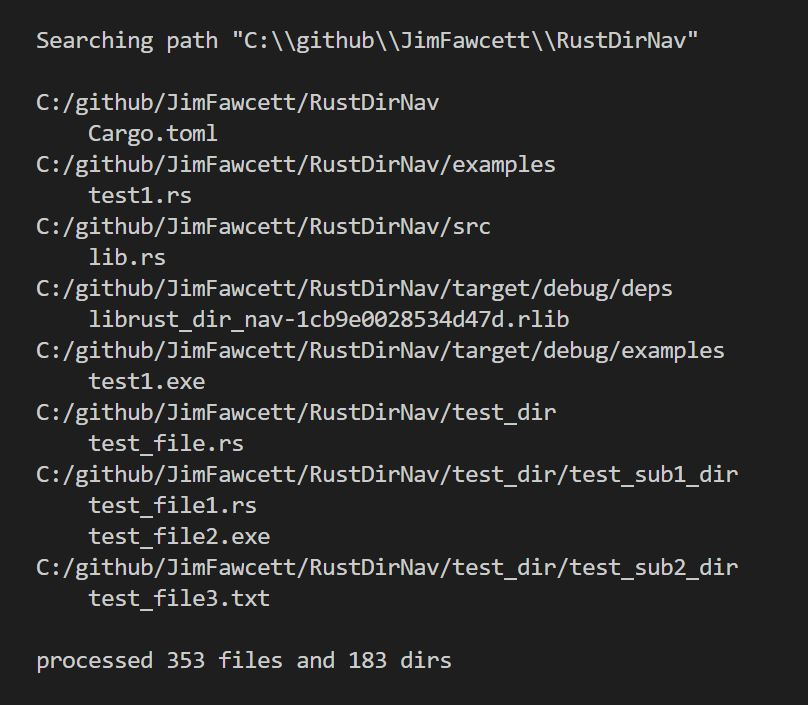

# RustDirNav

# RustDirNav  Repository

### DFS visitation of directory

Quick Status version 1.1.0 Code functions correctly No known defects Demonstration code yes Documentation yes Test cases coming soon Static library yes Build requires Rust installation Planned design changes None at this time

---

### Concept:

RustDirNav is a facility for Depth-First-Search (DFS) of specified directory tree. It uses a generic parameter to provide application specific do\_dir and do\_file operations.

<!--  -->

### Design:

There is one struct, DirNav<App>, with methods and functions implementing this design: Methods:

1.  **new() -> Self** 
    Create new DirNav which has visit method for recursive DFS.

2.  **add\_pat(&mut self, s&str) -> Self** 
    Add pattern to match file extension. Can be chained.
    
3.  **visit(&mut self, p:&Path)** 
    Walks directory tree rooted at path p, looking for files matching pattern(s).
    
4.  **recurse(&mut self, p:bool)** 
    Sets or resets option to recurse directory tree.
    
5.  **hide(&mut self, p:bool)** 
    Sets or resets option to hide directories with no target contents.
    
6.  **get\_app(&mut self) -> &mut app** 
    Retrieves reference to embedded application, set with generic parameter.
    
7.  **get\_dirs(&self) -> usize** 
    Retrieves the number of directories entered
    
8.  **get\_files(&self) -> usize** 
    Retrieves the number of files processed.
    
9.  **get\_patts(&self) -> &SearchPatterns** 
    Retrieves vector of patterns.
    
10.  **clear(&self)** 
    Returns DirNav<app> to its initial state.
    

The DirEvent trait constrains the App generic parameter to supply do\_dir and do\_file methods that define what the application will do when the navigator encounters a new directory or file.

pub trait DirEvent { fn do\_dir(&mut self, d: &str); fn do\_file(&mut self, f: &str); }

The DirNav package provides a demonstration of the library in its /examples/test1.rs file. For the demo, test1 simply displays each directory once, and all of the files in that directory. The App type is defined by implementing the DirEvent trait, which may contain data members. The lib.rs file defines all of the DirNav processing and, in its tests section, defines an ApplTest type that implements DirEvent and contains a vector that will hold each of the files found during test, so we can verify its operation.

### Operation:

See Test1.rs in examples folder for typical usage.

### Build:

Download and, in a command prompt, cargo build or cargo run.

### Status:

Version 1.1.0  
Tested on both Windows 10 and Ubuntu Linux

Rust Repositories
